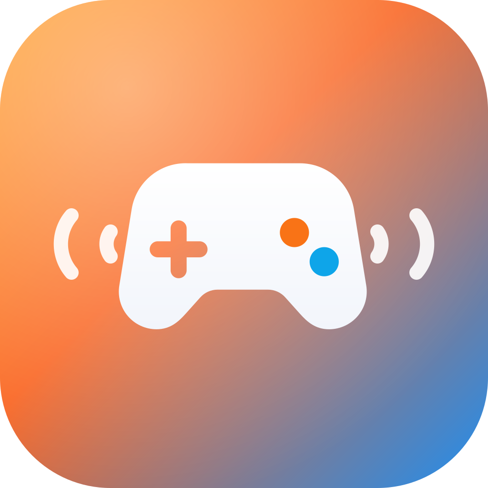
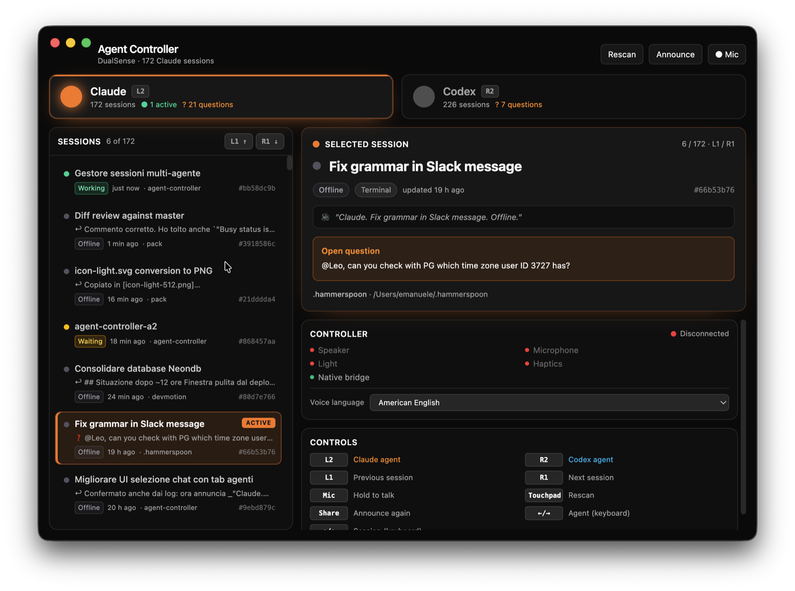

<div align="center">



# Agent Controller

### Your coding agents, on a game controller.

Hear Claude Code and Codex, answer out loud, and switch live sessions from a DualSense.

[](https://github.com/epavanello/agent-controller/releases/latest)
[](https://github.com/epavanello/agent-controller/releases/latest)
[](LICENSE)

**[Download for Apple silicon →](https://github.com/epavanello/agent-controller/releases/latest)**

[Build from source](#build-from-source) · [Contribute](#contributing)



</div>

## Step away from the keyboard

Agent Controller connects to the Claude Code and Codex sessions you already have open in a
terminal, VS Code, Cursor, or a desktop app. It does not spawn a second set of agents.

- **Hear the answer.** The DualSense speaker reads the selected agent's latest reply or question.
- **Talk back.** Hold the mic button, speak, and release to send your answer to that live session.
- **Feel the handoff.** Haptics tell you when an agent needs attention; the light shows which agent
  is selected.
- **Run the room.** Jump between Claude, Codex, and their sessions without finding the right window.

> Four agents are working. The controller buzzes and reads: “Should I drop the legacy column?”
> Tap L1 or R1 to find the session, hold Mic, answer, and let it continue.

## Get started

1. Download the latest notarized DMG from [GitHub Releases](https://github.com/epavanello/agent-controller/releases/latest).
2. Drag **Agent Controller** to Applications and open it.
3. Connect a DualSense and approve Microphone and Speech Recognition when macOS asks.

Requirements: macOS 14 or newer on Apple silicon, a Sony DualSense controller, and `claude`
and/or `codex` available in your shell `PATH`.

USB unlocks the controller speaker and microphone. Buttons, light, and haptics also work over
Bluetooth, but macOS does not expose the DualSense audio devices over Bluetooth.

## Controls

| Control        | Action                                 |
| -------------- | -------------------------------------- |
| **L2 / R2**    | Select Claude / Codex                  |
| **L1 / R1**    | Previous / next session                |
| **Mic (hold)** | Record; release to transcribe and send |
| **Touchpad**   | Rescan sessions                        |
| **Share**      | Announce the selected session again    |
| **← → / ↑ ↓**  | The same navigation from the keyboard  |

Orange means Claude; sky blue means Codex. A solid light means waiting, a slow pulse means
working, and a fast pulse means recording.

## Voice, privacy, and live sessions

Choose the announcement and dictation language in the Controller panel. Agent Controller only
offers voices installed on your Mac, and speech recognition runs on-device through Apple's Speech
framework.

When a session exposes a live messaging socket, your answer goes directly to that running process.
Offline sessions use one headless `claude --resume` or `codex exec resume` call. Transcript files
are discovered locally and are never edited by hand.

Power users can set `ttsLanguage`, `ttsVoice`, and `sttLanguage` separately in
`~/Library/Application Support/Agent Controller/config.json`.

## Contributing

Ideas, bug reports, and pull requests are welcome. Open an
[issue](https://github.com/epavanello/agent-controller/issues) for behavior changes, or send a
focused PR with a short explanation and screenshots for UI work.

## Build from source

You need Node.js 22+ and the Xcode command-line tools.

```sh
git clone https://github.com/epavanello/agent-controller.git
cd agent-controller
npm ci
npm run native:build
npm run dev
```

Before opening a pull request, run `npm run lint`, `npm run typecheck`, and
`swift build --package-path native`. Maintainers can find the signing and release checklist in
[docs/RELEASING.md](docs/RELEASING.md).

## Credits

The native DualSense work is derived from
[codex-controller](https://github.com/ParthJadhav/codex-controller) by Parth Jadhav (MIT). Agent
Controller adds multi-agent discovery, live-session delivery, the orchestrator, and the HUD.

Independent project. Not affiliated with Anthropic, OpenAI, or Sony. Released under the
[MIT License](LICENSE).
